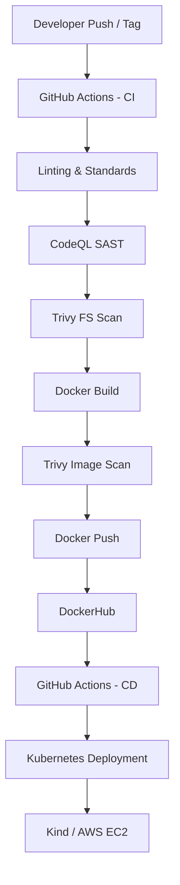
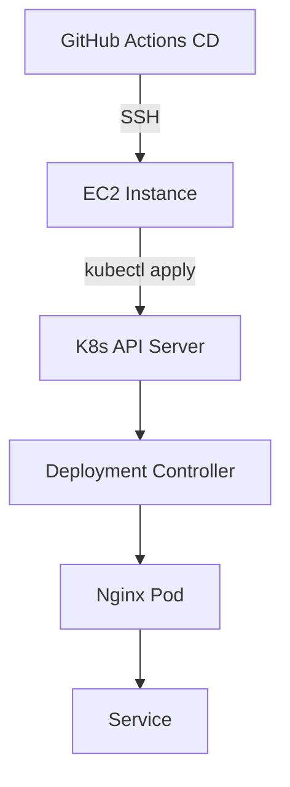

# Design and Implementation of a Production-Grade DevSecOps CI/CD Pipeline for a Modern Web Application using GitHub Actions, Docker, and Kubernetes

**Author:** Dipti Hatwar 
**Program:** DevOps  
**Project Type:** Advanced CI/CD & DevSecOps Pipeline  
**Submission Date:** 20 Jan 2026  
**Github Repository:** DEVOPS-PORTFOLIO

## 1. Introduction
Modern software delivery has evolved beyond simply compiling code and deploying applications. Production-grade systems require automation, security, reliability, and traceability across the entire software lifecycle. Continuous Integration (CI) and Continuous Deployment (CD) pipelines are the backbone of this evolution.

This project focuses on designing and implementing a real-world DevSecOps CI/CD pipeline using GitHub Actions, Docker, and Kubernetes. The project demonstrates these principles using a modern React-based web application served via Nginx, showcasing how frontend architectures can be rigorously pipelined.

The pipeline integrates shift-left security, immutable artifact creation, and declarative deployment, mirroring practices used in production environments.

## 2. Problem Background & Motivation

### 2.1 Industry Challenges
Common issues in poorly designed CI/CD pipelines include:
- Security checks performed too late
- Unoptimized or mutable container images
- Lack of artifact provenance
- CI and CD tightly coupled
- Manual deployments prone to human error

Such pipelines increase the risk of:
- Deployment failures
- Undetected vulnerabilities
- Unreliable releases

### 2.2 Motivation for This Project
The goal of this project is to design a thoughtful and secure pipeline that answers:
- Why does each stage exist?
- What risk does it mitigate?
- How does it improve delivery confidence?

This aligns with DevSecOps philosophy — security and quality are first-class citizens, not afterthoughts.

## 3. Application Overview

### 3.1 Application Description
The application is a **DevOps Portfolio** built with **React, Vite, and Tailwind CSS**.

**Key characteristics:**

| Attribute | Description |
| :--- | :--- |
| **Framework** | React + Vite |
| **Styling** | Tailwind CSS |
| **Runtime** | Nginx (Alpine) |
| **Interface** | Web UI (HTTP) |
| **Network** | Exposes Port 80 |

The application serves a responsive, interactive portfolio website capable of showcasing projects and skills.

### 3.2 Why This Application Is DevOps-Relevant
Deploying a single-page application (SPA) properly requires:
- Efficient multi-stage builds (Node.js build -> Nginx runtime)
- Security scanning of both source code (JS) and runtime base images (Alpine)
- Proper Kubernetes abstraction (Deployment + Service)

This demonstrates the end-to-end lifecycle of a production web artifact.

## 4. CI/CD Architecture Overview

### 4.1 High-Level Architecture


## 5. Continuous Integration (CI) Pipeline Design

### 5.1 CI Trigger Strategy
The CI pipeline is triggered on:
- Push to `main`
- Manual trigger (`workflow_dispatch`)

This enables:
- Continuous feedback
- Controlled releases
- Reproducible builds

### 5.2 CI Pipeline Stages

| Stage | Purpose | Risk Mitigated |
| :--- | :--- | :--- |
| **Checkout** | Fetch source | Inconsistent builds |
| **Setup Node.js** | Runtime consistency | Environment drift |
| **Linting (ESLint)** | Code standards | Technical debt & bugs |
| **CodeQL (SAST)** | Static analysis | Insecure code patterns |
| **Trivy FS Scan** | Filesystem scan | Exposed secrets/config flaws |
| **Docker Build** | Immutable artifact | “Works on my machine” |
| **Trivy Image Scan** | Image vulnerabilities | OS & library CVEs |
| **Docker Push** | Artifact publishing | Deployment readiness |

### 5.3 Shift-Left Security Implementation
Security is enforced early and repeatedly:
- **SAST (CodeQL):** Detects insecure patterns in JavaScript code.
- **SCA (Trivy FS):** Detects vulnerabilities in project files and dependencies.
- **Container Scanning (Trivy):** Detects OS-level vulnerabilities in the final Nginx image.

This ensures insecure code or containers never reach the registry.

## 6. Containerization Strategy

### 6.1 Dockerfile Design
Key production practices used:
- **Multi-stage build:**
    1.  **Build Stage:** Node.js image to compile React code.
    2.  **Runtime Stage:** Nginx Alpine image to serve static files.
- **Minimal Base Image:** Uses `alpine` for reduced attack surface.
- **No Root Process:** Nginx configured to run securely (standard practice).

These decisions reduce:
- Attack surface
- Image size (~20MB vs ~1GB for full Node images)
- Runtime instability

## 7. Continuous Deployment (CD) Pipeline Design

### 7.1 Separation of CI and CD
CI and CD are implemented as separate workflows.
**Principle followed:** Build once, deploy many times.
- CI produces artifacts (Docker Images).
- CD consumes them.
- CD never rebuilds images.

### 7.2 CD Trigger Strategy
The CD pipeline is triggered using:
```yaml
workflow_run:
  workflows: ["CI Pipeline"]
  types: [completed]
```
CD runs only if CI succeeds, enforcing strict pipeline ordering.

### 7.3 CD Pipeline Stages

| Stage | Purpose |
| :--- | :--- |
| **Validation** | Check CI success status |
| **SSH Connection** | Secure access to Deployment Node |
| **Kubectl Apply** | Declarative state application |

## 8. Kubernetes Deployment Design

### 8.1 Kubernetes Platform Choice
- **Platform:** Kind (Kubernetes in Docker) running on an EC2 instance.
- **Access:** Managed via `kubectl` over SSH.

### 8.2 Kubernetes Resources

| Resource | Reason |
| :--- | :--- |
| **Deployment** | Manages Pod replicas & rollouts |
| **Service** | Exposes the application mostly via NodePort/ClusterIP |

### 8.3 Kubernetes Architecture Diagram


## 9. DevSecOps & Supply-Chain Security

### 9.1 Zero-Trust & Scan
CI enforces strict scanning before pushing to DockerHub. If `Trivy` detects `CRITICAL` or `HIGH` vulnerabilities, the build fails, preventing the artifact from ever existing in the registry.

### 9.2 Auditability & Traceability
GitHub Actions provides:
- Execution logs
- Security findings (CodeQL tab)
- Artifact provenance
- Workflow traceability

This satisfies enterprise audit requirements.

## 10. Results & Observations

### 10.1 Outcomes Achieved
- Fully automated CI pipeline
- Secure container supply chain
- Kubernetes deployment without manual steps
- Clear separation of responsibilities
- Production-aligned DevOps design

### 10.2 Lessons Learned
- **Separation of Concerns:** Keep CI (Build) separate from CD (Deploy).
- **Security Gates:** Automated scans (Trivy/CodeQL) are essential "Go/No-Go" gauges.
- **Immutable Artifacts:** Never patch a running container; build a new one.

## 11. Limitations & Future Improvements

| Area | Improvement |
| :--- | :--- |
| **Signing** | Implement **Cosign** for image signing and verification. |
| **Configuration** | Adopt **Helm** or **Kustomize** for environment variance. |
| **Environments** | Add Staging vs Production promotion gates. |
| **Observability** | Integrate Prometheus/Grafana for monitoring. |
